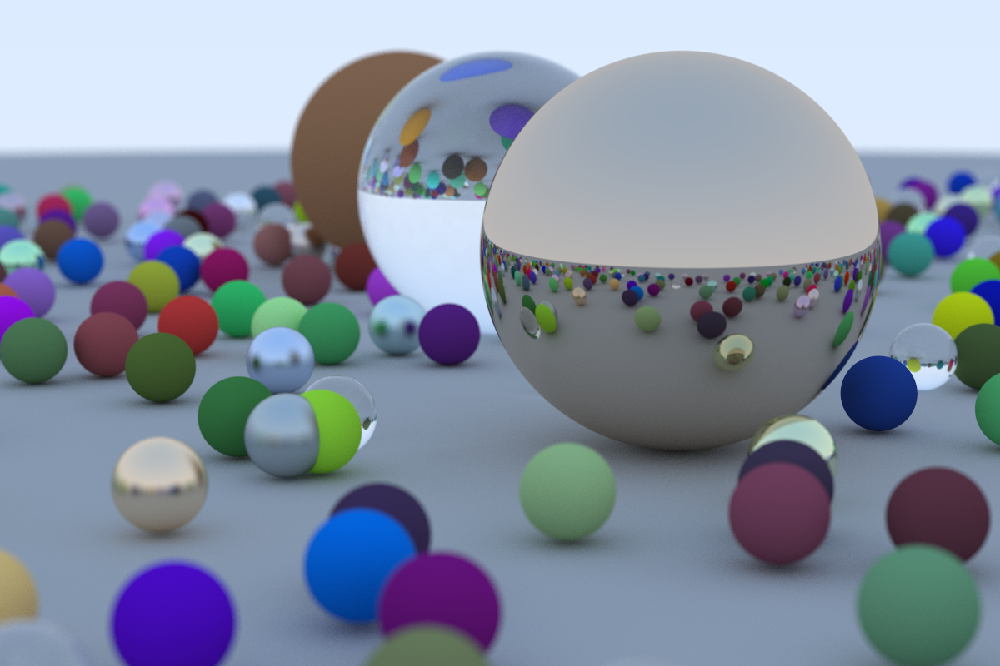

# Simple Raytracer
## Table of contents
- [Simple Raytracer](#simple-raytracer)
  - [Table of contents](#table-of-contents)
  - [General info](#general-info)
  - [Compilation](#compilation)
  - [Running](#running)
## General info
This repository is simple ray tracer program written in C++.



## Compilation
```
g++ -std=c++14 -o raytracer -O3 -Wall main.cpp
```
## Running 
```
./raytracer > image.ppm
```
